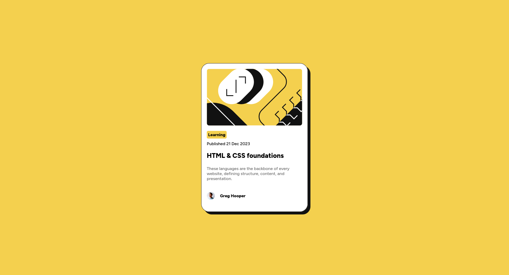

# Frontend Mentor - Blog preview card solution

This is a solution to the [Blog preview card challenge on Frontend Mentor](https://www.frontendmentor.io/challenges/blog-preview-card-ckPaj01IcS). Frontend Mentor challenges help you improve your coding skills by building realistic projects.

### Screenshot

### Links

- Solution URL: [solution URL](https://blog-view-frontend-mentor.vercel.app/)

### Built with

- Semantic HTML5 markup
- CSS custom properties
- Flexbox

### What I learned

- CSS variable
- responsive design
- flexbox
